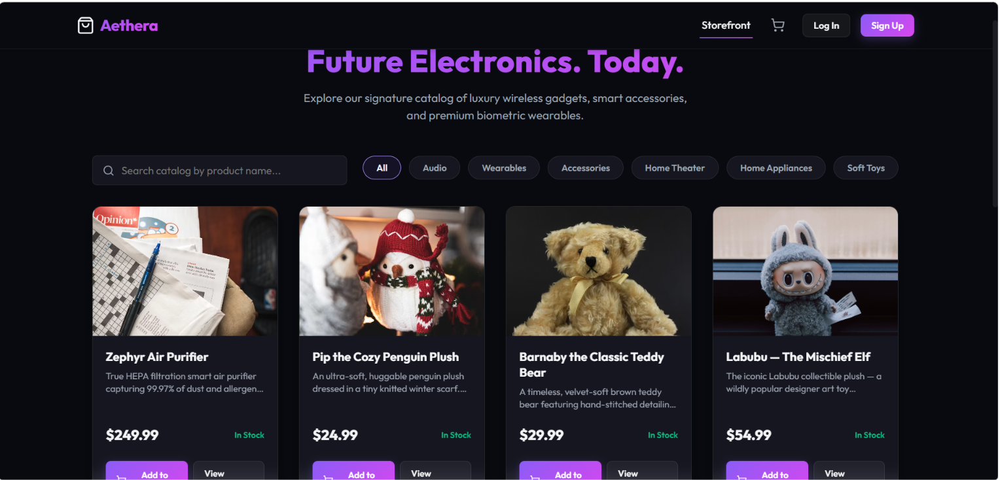
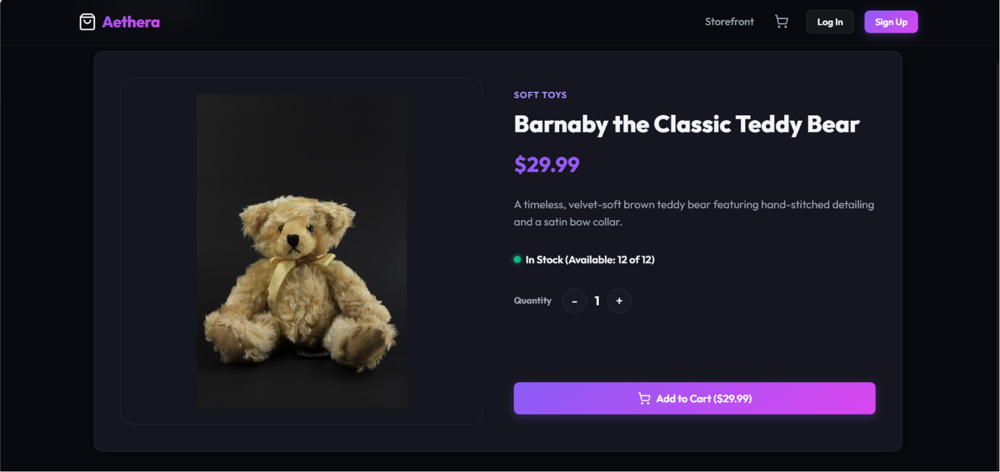
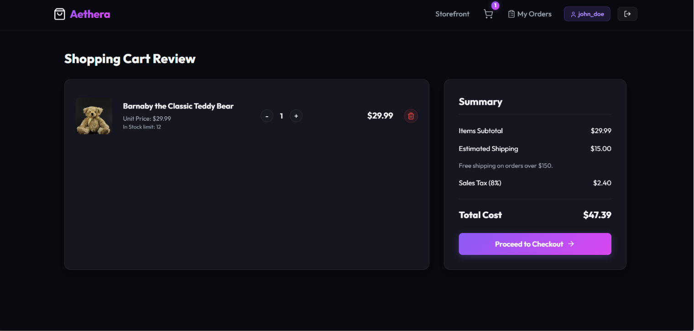
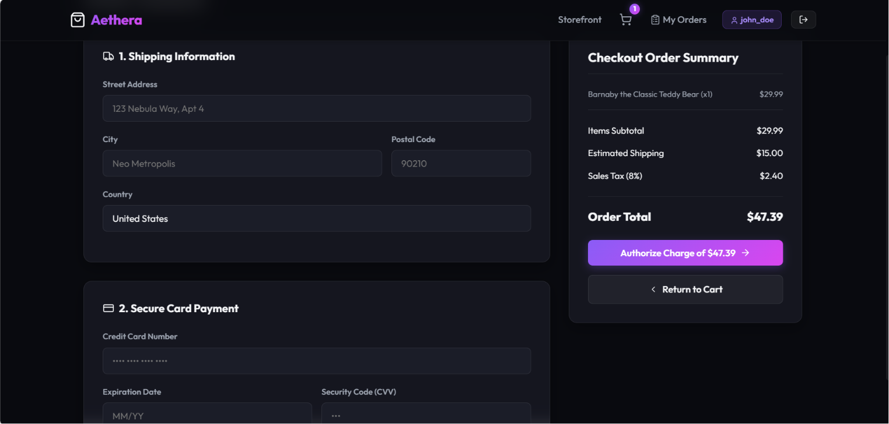
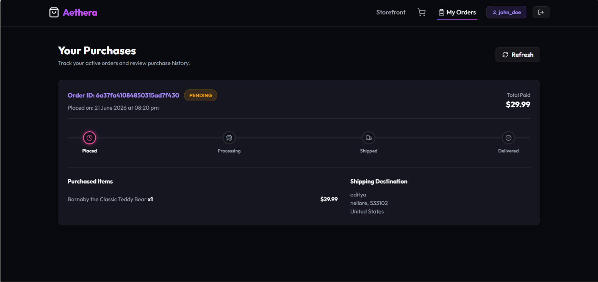
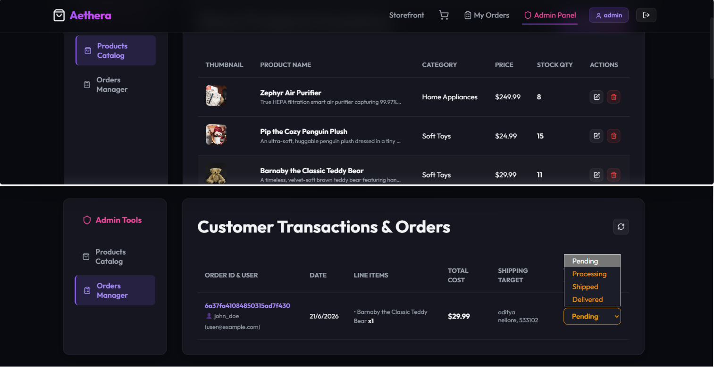

# Aethera | Premium Full-Stack E-Commerce Storefront

A premium, full-stack, responsive e-commerce storefront web application. The project features a React frontend client and an Express/Node.js backend server connecting to MongoDB Atlas for catalog storage and client orders tracking.

[](https://nageswarimahalakshmi.github.io/E-Commerce)
[](https://vite.dev)
[](https://mongodb.com)

---

## 🌐 Live Demo

> The application is deployed and accessible at:

**🔗 [https://nageswarimahalakshmi.github.io/E-Commerce](https://nageswarimahalakshmi.github.io/E-Commerce)**


---

## 🚀 Features

- **Premium Glassmorphic Design:** A stunning obsidian dark-mode interface utilizing Google Fonts (`Outfit`), glowing interactive card overlays, and fluid transitions.
- **Dynamic Catalog Fetch:** Queries catalog listings in real-time from MongoDB Atlas, supporting keyword search index and category tab filters.
- **Persistent Shopping Cart:** Add items to cart, modify unit quantities with stock limits checks, and persist selections across page loads.
- **Mock Checkout Processing:** Secure shipping form inputs validation and card mock payment visualization.
- **Order Tracking Timeline:** Beautiful step-by-step progress nodes visualizing package status shifts (Pending -> Processing -> Shipped -> Delivered).
- **Admin Dashboard Panel:** Fully managed inventory panel to add/edit/delete catalog products (CRUD) and change customer delivery states immediately.
- **Root Task Manager:** Concurrently runs both the backend server and frontend client dev servers using a single root command.

---

## 📂 Project Structure

```text
├── client/                 # React frontend application (Vite)
│   ├── public/             # Static assets (HTML, favicons)
│   ├── src/
│   │   ├── components/     # UI Elements (Navbar, ProtectedRoute, AdminRoute)
│   │   ├── context/        # AuthContext, CartContext providers
│   │   ├── pages/          # Catalog, ProductDetails, Cart, Checkout, OrderHistory, Admin
│   │   ├── App.jsx         # Application routing container
│   │   ├── index.css       # Core styling & custom HSL variable design system
│   │   └── main.jsx        # App mounting entry script
│   └── package.json        # Client package definitions
│
├── server/                 # Express backend API application
│   ├── config/
│   │   └── db.js           # Mongoose DB connection helper
│   ├── middleware/
│   │   └── authMiddleware.js # JWT authorization & Admin checking guards
│   ├── models/
│   │   ├── User.js         # User schema & encrypting password hooks
│   │   ├── Product.js      # Product schema
│   │   └── Order.js        # Order schema
│   ├── routes/
│   │   ├── authRoutes.js   # Session registration & profile routes
│   │   ├── productRoutes.js# Public lookup & Admin product CRUD
│   │   └── orderRoutes.js  # Order dispatching & status modifications
│   ├── scripts/
│   │   └── seed.js         # MongoDB initial data seeder script
│   ├── .env                # Server configuration secrets
│   ├── .env.example        # Environment variable template
│   ├── server.js           # Express API entry script
│   └── package.json        # Server package definitions
│
├── package.json            # Root manager scripts & concurrently setup
└── README.md               # Project documentation
```

---

## 🛠️ Installation & Setup

Ensure you have [Node.js](https://nodejs.org/) (v18+) installed.

### 1. Configure Environment Variables
Inside the `server/` directory, create a `.env` file (you can copy `.env.example`) and specify your MongoDB Atlas URI:
```env
PORT=5000
MONGO_URI=mongodb+srv://<username>:<password>@cluster.mongodb.net/aethera
JWT_SECRET=your_jwt_secret_key
```

### 2. Install All Dependencies
Run the installation script in the **root** folder to download npm packages for the root task manager, server, and client folders:
```bash
npm run install-all
```

### 3. Seed Database Data
To populate your MongoDB cluster with default tech products and customer/administrator profiles, run:
```bash
npm run seed
```

---

## 💻 Running the Application

To run the application locally, start both the Express API server and the Vite React client concurrently with a single command from the **root** folder:

```bash
npm run dev
```

### Direct scripts:
- **`npm run dev`**: Starts both client and server concurrently.
- **`npm run install-all`**: Installs packages for root, client, and server folders.
- **`npm run client`**: Starts only the React development server.
- **`npm run server`**: Starts only the Express backend server.

---

## 📸 Screenshots

#### 1. Catalog Storefront (Product grid, category filters, and search)


#### 2. Product Details (Quantity counters and inventory statuses)


#### 3. Shopping Cart (Listings review and subtotal breakdowns)


#### 4. Simulated Checkout (Shipping details and card payment mocks)


#### 5. Purchases Tracker (Delivery progress timeline)


#### 6. Admin Panel (Catalog management and fulfillment dispatcher)


---

## 🔒 Security Notice

This application features a **mock checkout flow**. Credit card numbers and CVV codes input on the checkout page are stored in temporary component memory during purchase validation and are **never** transmitted to the server or stored in the database.

*Always use fake card parameters (e.g., number `4111 1111 1111 1111`, CVV `123`) for testing.*
